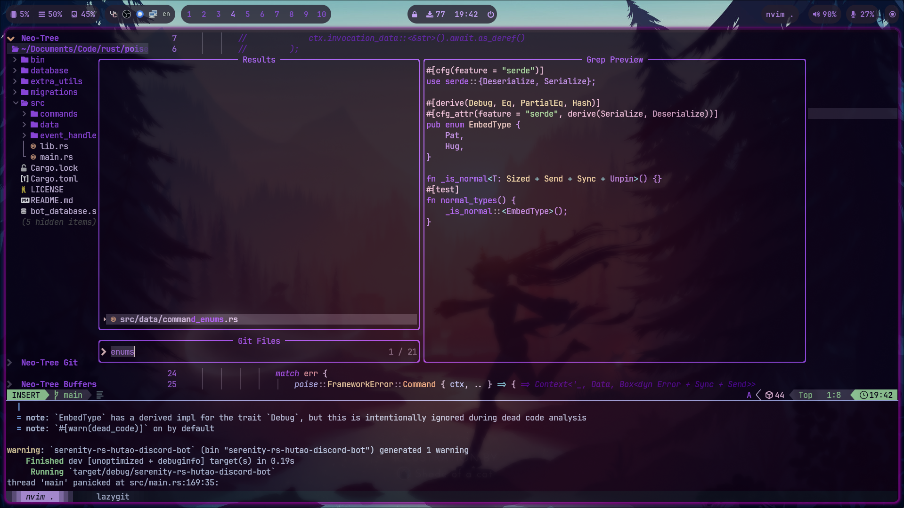
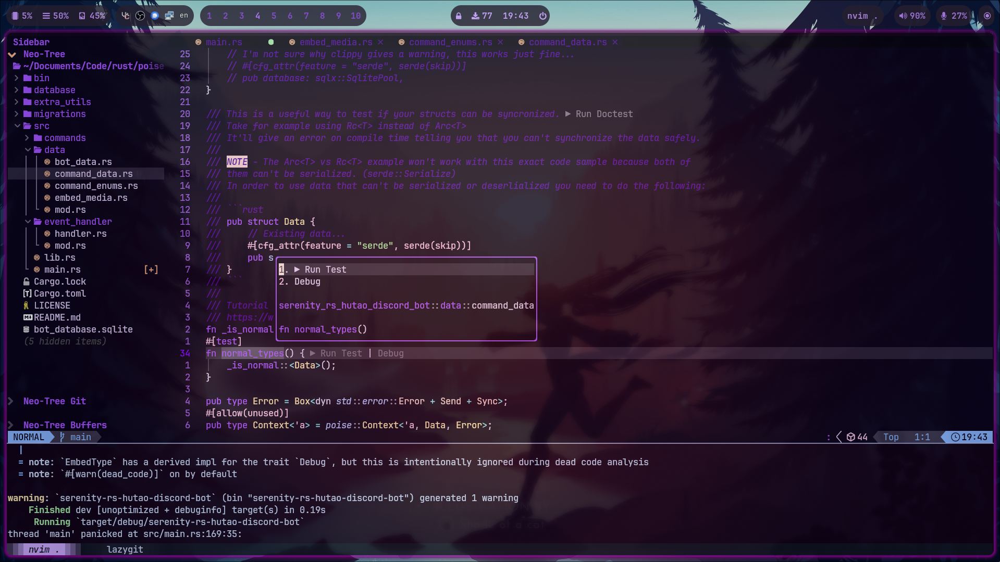
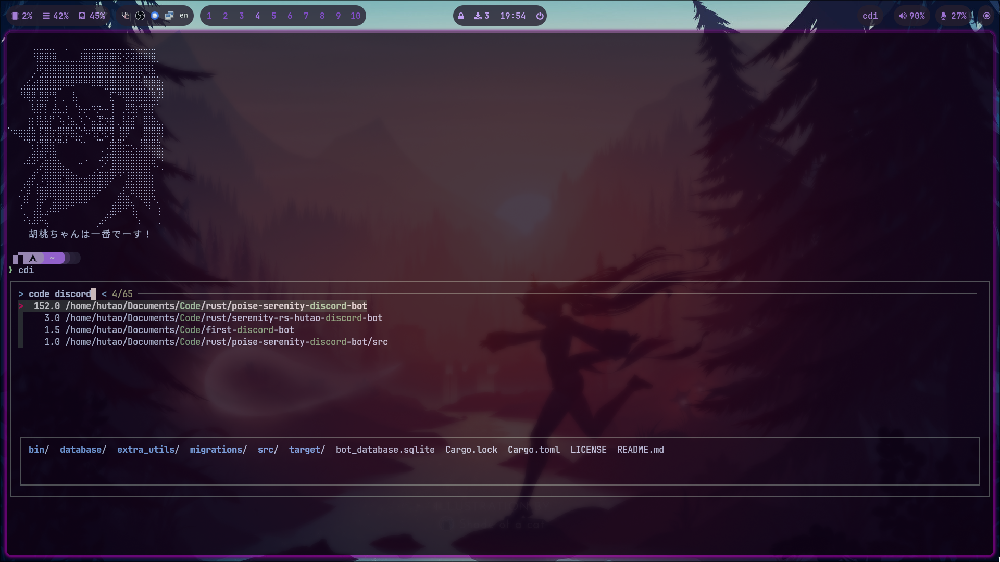
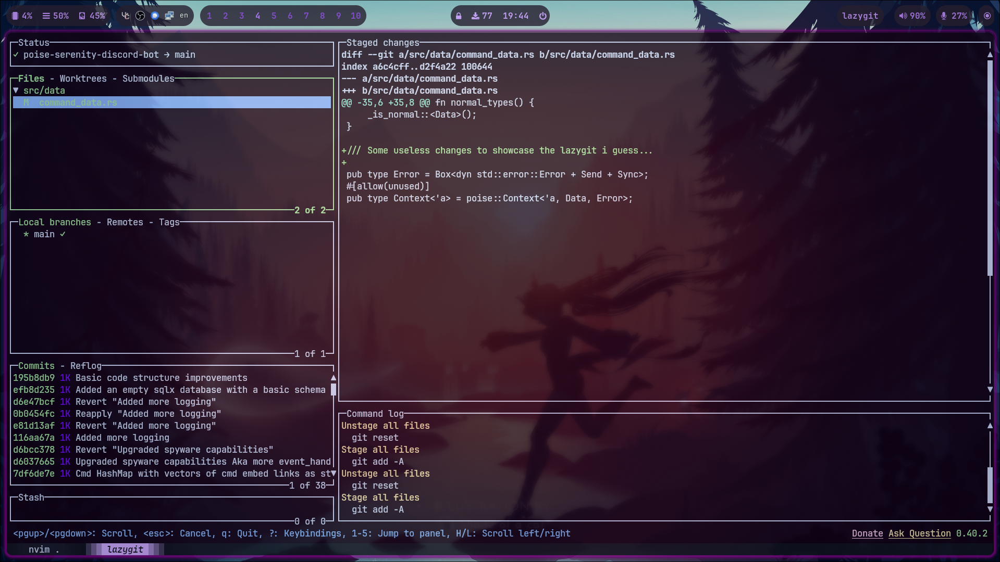
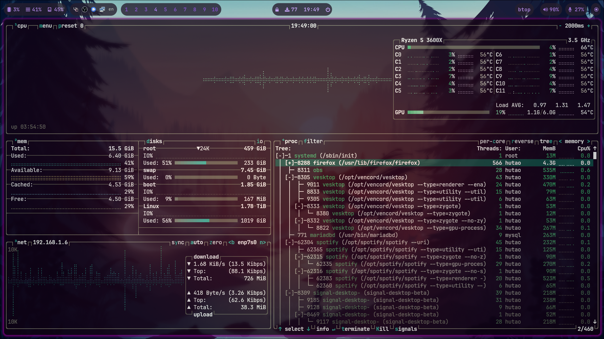

# Configuration files

Quick tip about querying your packages into your own file:

```sh
pacman -Qqe > target_file_location/target_file.txt
```

To install the queried packages:

```sh
sudo pacman -S --needed - < target_file_location/target_file.txt
```

_Feel free to replace pacman with paru, yay or whatever [AUR
helper](https://wiki.archlinux.org/title/AUR_helpers) you may use_

- But **_DON'T_** use `sudo` if you use an AUR helper!!!

Also, a lot of the packages **are** AUR packages, so don't worry about pacman
telling you they don't exist if you don't use an AUR helper to install them
with.

## Quick setup guide

```sh
chmod +x ./stow_setup.sh && chmod +x ./full_setup.sh # One time only

./full_setup.sh # Or ./stow_setup.sh if you only want the symlinks.
```

### Important notes

- **Both the i3 and Hyprland configurations assume DP-1 is a 1080p165hz
  monitor. _(easy to change)_**

### [Lazy Neovim](https://github.com/folke/lazy.nvim)




## Terminal utils

> [!NOTE]
> The screenshots from below are from my old Hyprland setup. The applications
> are the same but the windows don't have gaps and aren't rounded anymore in
> the i3 environment.

### Workflow video


### [Zoxide](https://github.com/ajeetdsouza/zoxide)



### [Lazygit](https://github.com/jesseduffield/lazygit)



### [Btop++](https://github.com/aristocratos/btop)



### Additional resources

- cattpuccin.nvim docs -
  [neovimcraft.com](https://neovimcraft.com/plugin/catppuccin/nvim/index.html)

  - Useful for those who want to change the styling under
    /nvim/lua/plugins/colorscheme.lua

- Make sure to check the `dot-config/programs/` folder which contains a bunch
  of useful utilities like a color hue shift script that changes the hues of
  every 6-digit HEX sequence with your specified offset (1-360) and some other
  apps. They're already added to your `$PATH` variable in `dot-profile`.
