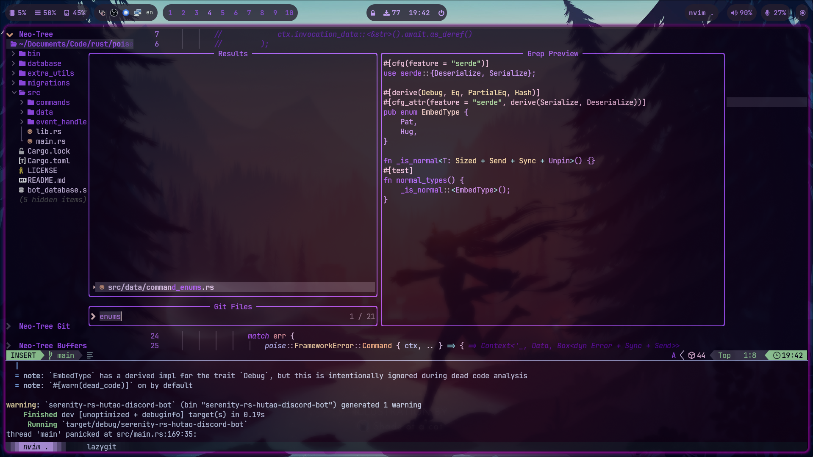
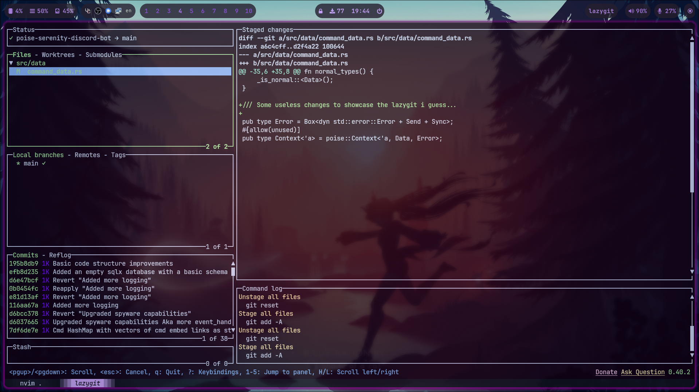

# Configuration files

Quick tip about querying your packages into your own file:

```sh
pacman -Qqe > target_file_location/target_file.txt
```

To install the queried packages:

```sh
sudo pacman -S --needed - < target_file_location/target_file.txt
```

*Feel free to replace pacman with paru, yay or whatever [AUR helper](https://wiki.archlinux.org/title/AUR_helpers) you may use*
- But __**DON'T**__ use `sudo` if you use an AUR helper!!!
Also, a lot of the packages **are** AUR packages, so don't worry about pacman telling you they don't exist if you don't use an AUR helper to install them with.

### Important notes

- **The [Neovim](https://github.com/neovim/neovim) configuration is the default [lazy.nvim](https://github.com/LazyVim/LazyVim) with some small extras. THEIR LICENSING STILL APPLIES THERE! (/nvim)**

- **The [Hyprland](https://hyprland.org/) configuration is just [HyprV4](https://github.com/soldoestech/hyprv4) with changed images and `mako` notification changes.**

## Preview (current v2 layout)


### [Lazy Neovim](https://github.com/folke/lazy.nvim)

**NOTE:** I'm too lazy to change the color scheming for the lualine at the bottom.




## Terminal utils

### [Zoxide](https://github.com/ajeetdsouza/zoxide)


### [Lazygit](https://github.com/jesseduffield/lazygit)



### Additional resources
- HyprV4 guide video - [YouTube](https://youtu.be/whAi_y_LfEE?si=VjWGe4B-OIfhH2xu) (By the author)
- cattpuccin.nvim docs - [neovimcraft.com](https://neovimcraft.com/plugin/catppuccin/nvim/index.html)
  - Useful for those who want to change the styling under /nvim/lua/plugins/colorscheme.lua
