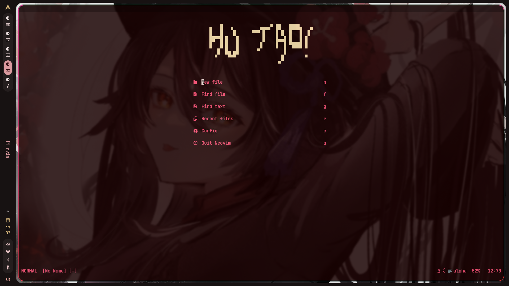
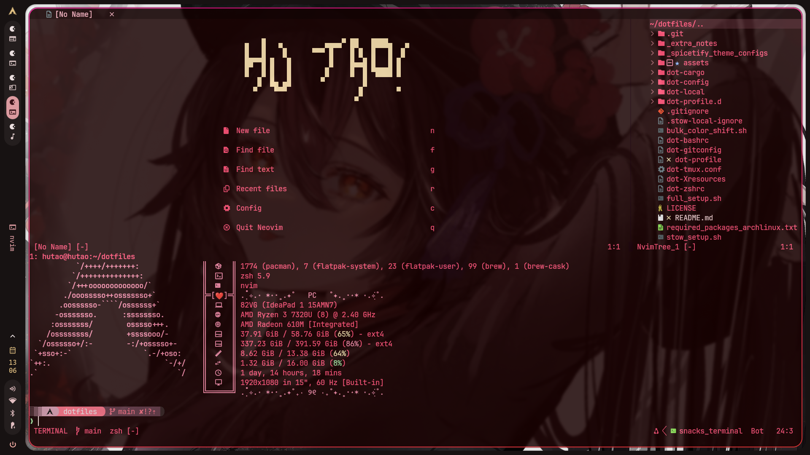
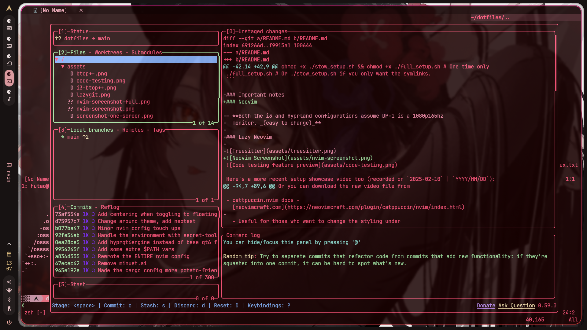
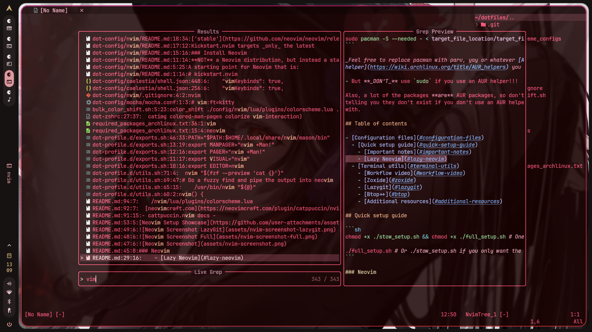

# Configuration files

Quick tip about querying your packages into your own file:

```sh
pacman -Qqe > target_file_location/target_file.txt
```

To install the queried packages:

```sh
sudo pacman -S --needed - < target_file_location/target_file.txt
```

_Feel free to replace pacman with paru, yay or whatever [AUR
helper](https://wiki.archlinux.org/title/AUR_helpers) you may use_

- But **_DON'T_** use `sudo` if you use an AUR helper!!!

Also, a lot of the packages **are** AUR packages, so don't worry about pacman
telling you they don't exist if you don't use an AUR helper to install them
with.
Full

## Table of contents

- [Configuration files](#configuration-files)
  - [Quick setup guide](#quick-setup-guide)
  - [Setup Showcase](#setup-showcase)
    - [Neovim](#neovim)
    - [Full Workflow video](#full-workflow-video)
  - [Additional resources](#additional-resources)

## Quick setup guide

```sh
chmod +x ./stow_setup.sh && chmod +x ./full_setup.sh # One time only

./full_setup.sh # Or ./stow_setup.sh if you only want the symlinks.
```

## Setup Showcase

### Neovim






> [!NOTE]
> The full Neovim setup can be found in [`dot-config/nvim`](./dot-config/nvim).
> It's based off [`kickstart.nvim`](https://github.com/nvim-lua/kickstart.nvim)
> but it's heavily modified (and likely will be modified more in the future) to
> match my workflow from [previously using LazyVim](https://www.lazyvim.org/).

### Full Workflow video

<!-- markdownlint-disable MD034 -->
<!-- Reason: GitHub embeds the link as a video directly. -->

https://github.com/user-attachments/assets/741b4680-d85f-49cb-abff-1d959bdc93c2

<!-- markdownlint-enable MD034 -->

> [!NOTE]
> Video files can be found in [`assets`](assets) in case you're viewing them
> outside of GitHub or you want to view the video files themselves.

## Additional resources

- cattpuccin.nvim docs -
  [neovimcraft.com](https://neovimcraft.com/plugin/catppuccin/nvim/index.html)
  - Useful for those who want to change the styling under
    /nvim/lua/plugins/colorscheme.lua

- Make sure to check the `dot-config/programs/` folder which contains a bunch
  of useful utilities like a color hue shift script that changes the hues of
  every 6-digit HEX sequence with your specified offset (1-360) and some other
  apps. They're already added to your `$PATH` variable in `dot-profile`.
  a/plugins/colorscheme.lua

- Make sure to check the `dot-config/programs/` folder which contains a bunch
  of useful utilities like a color hue shift script that changes the hues of
  every 6-digit HEX sequence with your specified offset (1-360) and some other
  apps. They're already added to your `$PATH` variable in `dot-profile`.
